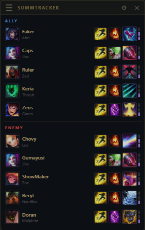

# SummTracker

A lightweight Tauri desktop overlay for League of Legends that tracks summoner spell and ultimate cooldowns for all 10 players in real time. Also does insta swapping in ARAM / ARAM Mayhem champ select.



## Features

- Automatically appears when a game starts, hides when it ends
- In ARAM / ARAM Mayhem champ select, click a bench champ in the overlay to insta swap
- Shows summoner spells and ultimate for every player, split by ally / enemy team
- Click any spell to start its cooldown timer, click again to reset
- Ult level pips update automatically as players level up
- Resizable and repositionable, position saves between sessions
- Cooldown data fetched from DDragon and cached locally, updates automatically each patch

## Installation

Download and run the installer from the [latest release](https://github.com/Vyriv/SummTracker/releases/latest).

No configuration needed. The overlay shows up in ARAM champ select and starts tracking as soon as you load into a game.

## How it works

SummTracker talks to the local League client. During a game it polls the [League Live Game Data API](https://developer.riotgames.com/docs/lol#game-client-api) for cooldowns. During ARAM champ select it uses the same local client connection to swap off the bench. No Riot API key is required.

Cooldown values are sourced from DDragon on first launch and cached until the next patch.

## Requirements

- Windows 10 / 11
- League of Legends installed and running

## Building from source

This project uses a Tauri backend with a Vite-rendered frontend.

```bash
npm install
npm run dev      # run in dev
npm run build    # build Windows installer
```
